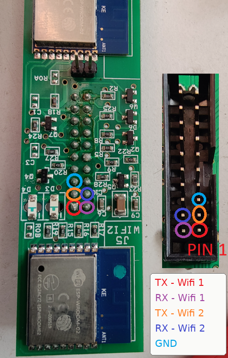
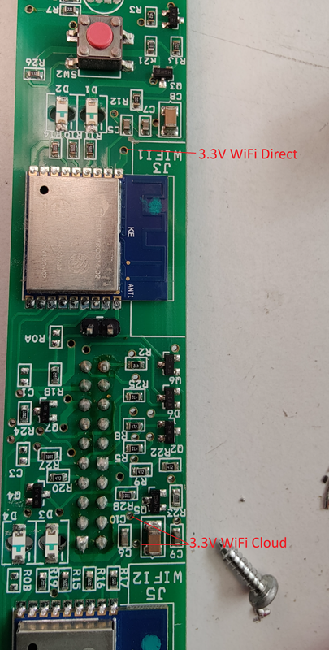
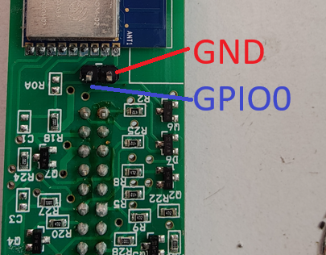

# Poêle MCZ Maestro : modules WiFi, protocole et firmware ESPHome

Ce document résume l'analyse des firmwares des modules WiFi d'un poêle à pellets MCZ (technologie Maestro) et leur remplacement par ESPHome pour un pilotage direct depuis Home Assistant.

Il couvre :

1. l'architecture matérielle et les échanges entre les éléments ;
2. le résultat de la décompilation des trois firmwares d'origine ;
3. le protocole série de la carte mère ;
4. les connexions pour reprogrammer les ESP8266 ;
5. la reprogrammation avec esptool ;
6. la configuration ESPHome.

> **Avertissement.** Ces informations viennent d'une analyse de firmwares et d'un projet communautaire, pas d'une documentation du fabricant. Un poêle à pellets est un appareil de combustion : fais les premiers essais de commande à distance en étant devant le poêle.

---

## 1. Vue d'ensemble

### Les éléments

| Élément | Puce | Firmware d'origine | Rôle |
|---|---|---|---|
| Module WiFi 1 (local) | ESP-WROOM-02 (ESP8266, 2 Mo) | Fluidsoft 1.2.4 | Point d'accès WiFi du poêle et serveur websocket |
| Module WiFi 2 (cloud) | ESP-WROOM-02 (ESP8266, 2 Mo) | Fluidsoft « MCZ-RemoteService » 1.2.5 | Connexion au WiFi de la maison et au serveur distant |
| Sonde d'ambiance déportée | ESP8266, 2 Mo | Fluidsoft « MCZ-Sensor » 1.3.1 | Mesure la température de la pièce et l'envoie au poêle |
| Carte mère du poêle | — | 1.8.2 sur le poêle étudié | Interprète toutes les commandes |

Les deux modules WiFi sont deux ESP8266 distincts, montés sur la même carte, chacun relié à la carte mère par sa propre liaison série. La carte mère commande aussi leur mise sous tension, l'un après l'autre (voir la partie 4).

### Qui parle à qui

```
Application (WiFi du poêle) ─┐
                             ├─ websocket :81 ─► Module WiFi 1 ─ série ─┐
Sonde d'ambiance ────────────┘                                          ├─► Carte mère
                                                                        │
Serveur distant ◄─ socket.io ─► Module WiFi 2 ───────────── série ──────┘
```

Point essentiel : **les modules WiFi ne font que relayer**. Aucun des trois firmwares n'interprète le contenu des commandes. Tout le sens du protocole est dans la carte mère.

### Outils utilisés

- Découpage des dumps : script `esp8266_split.py`.
- Décompilation : Ghidra 11.3 (processeur Xtensa), après conversion de l'image applicative en ELF avec les symboles de la ROM ESP8266.
- Les trois firmwares sont construits avec le core Arduino ESP8266 2.3.0 (SDK 1.5.3).

### Organisation de la flash (2 Mo)

| Adresse | Contenu |
|---|---|
| `0x000000` | Bootloader (eboot du core Arduino) |
| `0x001000` | Application |
| `0x1FB000` | EEPROM de l'application (sonde et module cloud) |
| `0x1FC000` | Données de calibration RF |
| `0x1FD000` – `0x1FF000` | Configuration WiFi du SDK |

Les dumps contiennent aussi des restes du firmware AT Espressif d'usine, inutilisés.

> **Confidentialité.** Le dump du module cloud contient le nom et le mot de passe du WiFi de la maison, en clair dans l'EEPROM. Ne partage pas ce fichier tel quel.

---

## 2. Résultats de la décompilation

### 2.1 Sonde d'ambiance « MCZ-Sensor » 1.3.1

**Rôle.** Sonde sur pile qui se réveille périodiquement, mesure la température, l'envoie au poêle, puis se rendort.

**Matériel.**

| Broche | Usage |
|---|---|
| GPIO4 / GPIO5 | I2C (SDA / SCL) vers le capteur NCT75, adresse `0x48` |
| GPIO14 | Alimentation du capteur, activée seulement pendant la mesure |
| GPIO13 | Bouton de réinitialisation (actif à la masse au démarrage) |
| GPIO2 | Sortie configurée mais jamais pilotée |

**Déroulement d'un cycle.**

1. Alimentation du NCT75, lecture de 2 octets, conversion en °C (0,0625 °C par pas), coupure de l'alimentation. Une valeur négative ou supérieure à 100 °C est remplacée par 0.
2. Connexion au point d'accès du poêle avec l'IP fixe `192.168.120.51`.
3. Ouverture d'une websocket vers `192.168.120.1`, port 81, sous-protocole `arduino`.
4. Envoi d'une trame texte unique (voir ci-dessous).
5. Réception de la réponse : deux caractères hexadécimaux donnant le nombre de minutes avant le prochain réveil.
6. Mise en veille profonde. Sans réponse sous 5 secondes, veille avec le dernier intervalle connu (15 minutes par défaut).

**Trame envoyée.**

```
C|RecuperaTemperaturaWiFi|51|<T>|<version>|<champ5>|<qualité>
```

| Champ | Valeur | Origine |
|---|---|---|
| `51` | constante | Codée en dur |
| `<T>` | température × 2, entier | 21,5 °C donne `43` |
| `<version>` | `1.3.1` | Version du firmware de la sonde |
| `<champ5>` | `00` | Jamais modifié ; rôle inconnu |
| `<qualité>` | 0 à 100 | 0 si RSSI ≤ -100 dBm, 100 si ≥ -50 dBm, sinon `2 × (RSSI + 100)` |

La carte mère ne vérifie pas le numéro de version (constaté à l'usage). Elle n'exploite que des demi-degrés.

**Appairage.**

- Sans réseau enregistré, la sonde ouvre un point d'accès « MCZ-Sensor » avec une page « Select your Stove » pendant 8 minutes.
- Au premier contact après appairage, elle envoie en plus `C|WriteBancaDati|356|1|FF`, probablement pour activer la sonde WiFi côté poêle.
- GPIO13 à la masse au démarrage efface la configuration.

**EEPROM.**

| Adresse | Contenu |
|---|---|
| `0x00` – `0x1F` | SSID du poêle |
| `0x20` – `0x3F` | Mot de passe |
| `0x40` | Drapeau d'appairage (`B` = vient d'être appairé, `A` = déjà annoncé) |
| `0x41` – `0x42` | Dernier intervalle de sommeil reçu, en hexadécimal |

### 2.2 Module WiFi 1 (local), firmware 1.2.4

**Rôle.** Point d'accès WiFi du poêle et passerelle websocket vers la liaison série de la carte mère. C'est à lui que se connectent l'application en mode direct et la sonde d'ambiance.

**Réseau.**

- SSID : `MCZ-01` suivi de l'adresse MAC du point d'accès en hexadécimal majuscule.
- Mot de passe : dérivé du SSID (voir encadré).
- Adresse du module : `192.168.120.1`.
- DHCP : adresses `.100` à `.200`, 4 clients au maximum.
- Portail captif sur le port 80, qui affiche seulement « Connesso con successo alla stufa ».

> **Dérivation du mot de passe.** Le mot de passe est la concaténation des codes ASCII décimaux des caractères du SSID aux positions 15, 13, 17, 12 et 16 (en comptant à partir de 0).
> Exemple fictif : pour `MCZ-01AABBCCDDEEFF`, ces caractères sont `E`, `D`, `F`, `D`, `F`, soit `69`, `68`, `70`, `68`, `70`, donc le mot de passe `6968706870`.

**Passerelle.**

- Serveur websocket sur le port 81, sous-protocole `arduino`, 5 clients au maximum.
- Une trame texte commençant par `C` est envoyée telle quelle à la carte mère, suivie de `^` et d'un saut de ligne.
- La réponse est lue jusqu'au `^`, les `%7C` sont remplacés par `|`, puis elle est renvoyée au seul client demandeur.
- Une trame commençant par `P` sert de signe de vie, sans réponse. Tout le reste est ignoré.

**Autres comportements.**

- Au démarrage, puis après 30 secondes sans trafic, envoi à la carte mère de `RispostaAccensioneDirect|<ssid>|<mot de passe>|1.2.4^`.
- Toutes les 20 secondes, ping websocket des clients. Un client en `.51` à `.60` (plage des sondes) qui ne répond pas est déconnecté ; un client DHCP muet depuis 20 secondes provoque un redémarrage du module.
- Vitesse série : 115200 bauds par défaut. La commande `CambioBaudSerial` permet 9600, 38400 ou 57600 ; la valeur est gardée en EEPROM.
- LED : GPIO13 clignote à 1 Hz ; GPIO12 est mis à 0 au démarrage et n'est plus modifié.

### 2.3 Module WiFi 2 (cloud), firmware « MCZ-RemoteService » 1.2.5

**Rôle.** Accès distant. Le module se connecte au WiFi de la maison, puis à un serveur socket.io, et relaie les commandes du serveur vers la carte mère.

**Déroulement.**

1. Envoi à la carte mère de `RispostaAccensioneRemoto|<MAC>|1.2.5^`.
2. Connexion au WiFi enregistré en EEPROM. Sans réseau, ouverture d'un point d'accès ouvert « MCZ-RemoteService » avec une page de choix du réseau.
3. Demande de l'adresse du serveur à la carte mère avec `RecuperoSerialeIP^`. La réponse contient quatre champs séparés par `|` ; les trois derniers sont le numéro de série, l'hôte et le port. **L'adresse du serveur n'est donc pas dans le firmware.**
4. Connexion socket.io (chemin `/socket.io/?EIO=3`) et envoi de l'événement `join` avec le numéro de série, l'adresse MAC, le type `stove` et la révision.
5. À chaque commande reçue : le serveur envoie un objet JSON avec `richiesta`, `socketChiamata` et `idChiamata`. Le contenu de `richiesta` part vers la carte mère suivi de `^` ; la réponse est renvoyée dans un événement `rispondo`, avec les deux identifiants recopiés.

**Autres comportements.**

- Ping socket.io toutes les 25 secondes. Redémarrage si le WiFi tombe.
- Après 30 secondes sans message du serveur, nouvelle annonce série à la carte mère.
- Vitesse série : même mécanisme que le module local, mémorisée à l'adresse EEPROM `0x46`.
- LED : GPIO13 clignote pendant le portail de configuration puis suit l'état de la connexion ; GPIO12 est mis à 0 au démarrage.

**EEPROM.**

| Adresse | Contenu |
|---|---|
| `0x00` – `0x1F` | SSID du WiFi de la maison |
| `0x20` – `0x3F` | Mot de passe du WiFi, en clair |
| `0x40` | Drapeau écrit par le portail de configuration |
| `0x46` – `0x49` | Vitesse série divisée par 2, en hexadécimal |

### 2.4 Limites de l'analyse

- Les noms de fonctions et de variables n'existent pas dans les binaires ; la logique a été relue dans le pseudo-C produit par Ghidra.
- Quelques points sont des interprétations plus que des lectures directes : le détail du clignotement des LED, l'effacement de la configuration WiFi au démarrage du module local, le redémarrage sur perte du WiFi du module cloud.
- Le chiffrement de la connexion au serveur distant n'a pas été vérifié.
- Le rôle du premier champ de la réponse à `RecuperoSerialeIP` est inconnu.

---

## 3. Protocole série de la carte mère

**Liaison.** UART principal de l'ESP8266 (TX sur GPIO1, RX sur GPIO3), 115200 bauds.

**Format.**

- Envoi : `<commande>^` suivi d'un retour à la ligne.
- Réponse : champs séparés par `|`, terminée par `^`. Le séparateur peut arriver encodé en `%7C`.
- Les valeurs de la trame d'information sont en hexadécimal.

### Commandes

| Commande | Effet |
|---|---|
| `C\|RecuperoInfo` | Demande la trame d'information (type `01`) |
| `C\|WriteParametri\|<n°>\|<valeur>` | Écrit un paramètre |
| `C\|SalvaDataOra\|jjmmaaaaHHMM` | Règle la date et l'heure |
| `C\|RecuperaTemperaturaWiFi\|51\|…` | Température d'une sonde WiFi (voir 2.1) |
| `C\|WriteBancaDati\|356\|1\|FF` | Envoyée par la sonde à son premier contact |
| `CambioBaudSerial` | Changement de vitesse série |
| `RecuperoSerialeIP` | Numéro de série et adresse du serveur distant |

### Paramètres d'écriture utilisés

| N° | Fonction | Valeurs |
|---|---|---|
| 34 | Marche / arrêt | `1` = allumer, `40` = éteindre |
| 42 | Consigne de température | température × 2 |
| 36 | Puissance | `11` à `15` pour les puissances 1 à 5 |
| 37 | Ventilation frontale | `0` = arrêt (« No Air »), 1 à 5 = vitesse manuelle, `6` = automatique |
| 38 | Ventilation canalisée 1 | `0` = arrêt (« No Air »), 1 à 5 = vitesse manuelle, `6` = automatique |
| 35 | Mode Active | 0 / 1 |
| 40 | Mode de régulation | `0` = manuel, `1` = automatique |
| 41 | Mode éco | 0 / 1 |
| 45 | Mode silencieux | 0 / 1 |
| 50 | Sons | 0 / 1 |
| 1111 | Chronothermostat | 0 / 1 |
| 1 | Acquittement d'alarme | `255` |

### Champs de la trame d'information utilisés

| Champ | Contenu | Conversion |
|---|---|---|
| 1 | État du poêle | code (voir ci-dessous) |
| 2 | Ventilation frontale | 0 = arrêt (« No Air »), 1 à 5 = vitesse manuelle, 6 = automatique |
| 3 | Ventilation canalisée 1 | 0 = arrêt (« No Air »), 1 à 5 = vitesse manuelle, 6 = automatique |
| 5 | Température des fumées | °C |
| 6 | Température ambiante | ÷ 2 |
| 10 | Bougie | 0 = éteinte |
| 11 | Active, consigne | sans unité |
| 12 | Extracteur de fumées | tr/min |
| 13 | Vis sans fin, consigne | tr/min |
| 14 | Vis sans fin, réelle | tr/min |
| 17 | Brasier | 0 = propre |
| 18 | Profil | code |
| 20 | Mode Active | 0 / 1 |
| 21 | Active, mesure | sans unité |
| 22 | Mode de régulation | 0 = manuel, 1 = automatique |
| 23 | Mode éco | 0 / 1 |
| 24 | Mode silencieux | 0 / 1 |
| 25 | Chronothermostat | 0 / 1 |
| 26 | Consigne | ÷ 2 |
| 28 | Température carte mère | ÷ 2 |
| 29 | Puissance | 11 à 15 pour les puissances 1 à 5 |
| 30 | Firmware carte mère | 3 octets : `0x010802` = 1.8.2 |
| 32 – 36 | Heure, minute, jour, mois, année | |
| 37 | Durée totale de fonctionnement | secondes |
| 38 – 42 | Durée en puissance 1 à 5 | secondes |
| 43 | Heures avant entretien | heures |
| 45 | Nombre d'allumages | |
| 46 | Active, température | sans unité |
| 49 | Sons | 0 / 1 |
| 52 | Température de la sonde WiFi 1 | ÷ 2 |

### États du poêle

| Code | État | Code | État |
|---|---|---|---|
| 0 | Éteint | 31 | Allumé |
| 1 | Contrôle chaud/froid | 40 | Extinction |
| 2 | Nettoyage à froid | 41 | Refroidissement |
| 3 | Chargement pellets à froid | 42 – 43 | Nettoyage bas / haut |
| 4 – 5 | Démarrage 1 / 2 à froid | 44 | Déblocage vis |
| 6 | Nettoyage à chaud | 45 | Auto éco |
| 7 | Chargement pellets à chaud | 46 | Veille |
| 8 – 9 | Démarrage 1 / 2 à chaud | 49 | Chargement vis |
| 10 | Stabilisation | 50 – 67 | Alarmes A01 à A23 |
| 11 – 15 | Puissance 1 à 5 | 69 | Attente alarmes sécurité |
| 30, 48 | Diagnostic | | |

La table complète des champs, des commandes et des alarmes vient du projet [Chibald/maestrogateway](https://github.com/Chibald/maestrogateway).

---

## 4. Connexions pour la reprogrammation

Les deux ESP8266 sont sur la même carte. La reprogrammation utilise trois points d'accès : le connecteur du module (liaison série), un connecteur 2 broches (mode programmation) et deux vias (alimentation de l'ESP à programmer).

### Alimentation de la carte

En fonctionnement normal, les ESP8266 ne sont pas alimentés directement par le connecteur :

- le +5 V du connecteur alimente un régulateur AMS1117, qui produit le 3,3 V de la carte ;
- chaque ESP8266 reçoit ce 3,3 V à travers un transistor ;
- la carte mère pilote ces transistors par d'autres broches du connecteur, et met les deux ESP8266 sous tension l'un après l'autre au démarrage, pour éviter un fort appel de courant.

Conséquence pour la reprogrammation : **le +5 V du connecteur n'est pas utilisé**. Sans la carte mère pour piloter les transistors, il n'alimenterait aucun ESP8266. On alimente uniquement l'ESP8266 à programmer, en 3,3 V, par deux vias de la carte.

### Connecteur du module WiFi

Le connecteur est une embase à deux rangées. La broche 1 est du côté du module WiFi 2 (repère `J5 WIFI2` sur la carte). Les broches impaires sont sur une rangée, les broches paires sur l'autre.

| Broche | Signal | Module | Utilisée pour la programmation |
|---|---|---|---|
| 1 | TX | Module WiFi 1 (local) | oui, pour le module 1 |
| 2 | RX | Module WiFi 1 (local) | oui, pour le module 1 |
| 3 | TX | Module WiFi 2 (cloud) | oui, pour le module 2 |
| 4 | RX | Module WiFi 2 (cloud) | oui, pour le module 2 |
| 5 | GND | | oui |
| 6 | +5 V | | non |

Les autres broches, dont celles par lesquelles la carte mère commande l'alimentation des ESP8266, ne sont pas répertoriées ici.



*Figure 1 — Connecteur du module WiFi, côté soudures et côté embase : TX et RX des deux modules, masse et position de la broche 1.*

<!-- IMAGE : vue d'ensemble de la carte, avec les deux modules, le regulateur AMS1117 et les transistors reperes -->


*Figure 2 — Carte WiFi : module 1 (local), module 2 (cloud), régulateur et transistors d'alimentation.*

### Vias d'alimentation

La carte comporte un via par ESP8266. Chaque via contourne le transistor et arrive directement sur la broche 3V3 de son ESP8266 : on y applique le 3,3 V pour alimenter uniquement le module à programmer.

| Via | Emplacement sur la carte |
|---|---|
| 3,3 V du module WiFi 1 (local) | au-dessus du module, près du repère `J3 WIFI1` |
| 3,3 V du module WiFi 2 (cloud) | près des condensateurs C6 et C9, à côté du repère `J5 WIFI2` |



*Figure 3 — Vias d'alimentation 3,3 V : « WiFi Direct » pour le module 1, « WiFi Cloud » pour le module 2.*

### Connecteur 2 broches (mode programmation)

Ce connecteur se trouve entre le module WiFi 1 et le connecteur principal, près du repère `ROA`.

| Broche | Signal |
|---|---|
| Côté module WiFi 1 | GND |
| Côté connecteur principal | GPIO0 des deux ESP8266 |

Relier ces deux broches met GPIO0 à la masse pour les deux ESP8266. Seul celui qui est alimenté par son via démarre en mode programmation ; l'autre n'est pas sous tension et n'est pas touché.



*Figure 4 — Connecteur 2 broches : GND et GPIO0.*

### Câblage vers l'adaptateur USB-série

Pour reprogrammer le **module WiFi 2 (cloud)** :

| Carte WiFi | Adaptateur USB-série |
|---|---|
| Broche 3 (TX module 2) | RX |
| Broche 4 (RX module 2) | TX |
| Broche 5 (GND) | GND |
| Via d'alimentation du module 2 | 3,3 V |

Pour le module WiFi 1 (local), utiliser la broche 1 (TX), la broche 2 (RX) et le via d'alimentation du module 1.

<!-- IMAGE : montage complet, carte reliee a l'adaptateur USB-serie, fil 3,3 V sur le via -->


*Figure 5 — Câblage complet pour la reprogrammation du module 2.*

**Précautions.**

- Débrancher la carte du poêle avant de la relier à l'adaptateur.
- Les signaux TX et RX se croisent : le TX de la carte va sur le RX de l'adaptateur.
- Alimenter en 3,3 V uniquement, et régler l'adaptateur sur des niveaux logiques 3,3 V. Ne jamais appliquer de 5 V sur un via.
- Un ESP8266 consomme des pointes de plusieurs centaines de milliampères en WiFi. Si l'adaptateur ne fournit pas assez de courant en 3,3 V, la programmation échoue de façon aléatoire : utiliser alors une alimentation 3,3 V séparée, masse commune avec l'adaptateur.

---

## 5. Reprogrammation avec esptool

Remplacer `COM3` par le port de l'adaptateur (`/dev/ttyUSB0` sous Linux). Avec une version d'esptool antérieure à la 5, les commandes s'écrivent avec un tiret bas (`read_flash`, `erase_flash`, `write_flash`, `--flash_mode`, `--flash_size`).

### Entrer en mode programmation

1. Poser le pont entre GND et GPIO0.
2. Appliquer le 3,3 V sur le via de l'ESP8266 à programmer.
3. Le pont peut rester en place pendant toutes les opérations esptool. Après chaque commande, couper puis rétablir le 3,3 V pour revenir en mode programmation.

### Vérifier la connexion

```
esptool --port COM3 flash-id
```

### Sauvegarder le firmware d'origine

À faire avant toute écriture. C'est la seule façon de revenir en arrière.

```
esptool --port COM3 --baud 115200 read-flash 0 0x200000 backup-wifi2.img
```

### Effacer la flash

```
esptool --port COM3 erase-flash
```

L'effacement supprime les restes de l'ancien firmware, dont le mot de passe WiFi stocké en clair, et évite qu'ESPHome démarre sur d'anciens réglages.

### Écrire le firmware ESPHome

Sur ESP8266, ESPHome produit un seul fichier, à écrire à l'adresse `0x0`. Il ne contient que le programme (environ 450 ko), pas une image complète de la flash.

```
esptool --port COM3 --baud 115200 write-flash --flash-mode dout --flash-size 2MB 0x0 firmware.bin
```

Le mode `dout` fonctionne sur toutes les puces flash.

### Redémarrer

1. Couper le 3,3 V.
2. Retirer le pont GND–GPIO0.
3. Remettre le 3,3 V pour un essai sur table, ou remonter la carte sur le poêle : le module rejoint le WiFi et apparaît dans Home Assistant. S'il ne se connecte pas, il ouvre un point d'accès de secours.

Aucun message n'apparaît sur le port série : les logs y sont désactivés, la liaison étant réservée au poêle. Ils passent par le WiFi. Les mises à jour suivantes se font par le WiFi (OTA).

### Revenir au firmware d'origine

```
esptool --port COM3 write-flash --flash-mode dout --flash-size 2MB 0x0 backup-wifi2.img
```

---

## 6. Configuration ESPHome

Fichier : `mcz-poele.yaml`. Il remplace le firmware du module WiFi 2 (cloud). Le module WiFi 1 (local) n'est pas modifié : l'application en mode direct et le point d'accès du poêle continuent de fonctionner.

### Principe

- Le module se connecte au WiFi de la maison et à Home Assistant par l'API native d'ESPHome.
- Il interroge la carte mère avec `C|RecuperoInfo` toutes les 15 secondes et après chaque écriture.
- Une seule commande est en cours à la fois sur la liaison série, avec 2 secondes d'attente maximum.
- Au démarrage, il envoie l'annonce `RispostaAccensioneRemoto|<MAC>|<version>`, comme le firmware d'origine.

### Réglages en tête de fichier

| Substitution | Rôle |
|---|---|
| `name`, `friendly_name` | Nom de l'appareil |
| `poll_interval` | Période d'interrogation de la carte mère |
| `reboot_timeout` | Délai avant redémarrage sans WiFi ou sans Home Assistant |
| `update_interval` | Période du capteur de signal WiFi |
| `room_temp_entity` | Capteur Home Assistant utilisé par la sonde virtuelle |

Secrets attendus dans `secrets.yaml` : `wifi_ssid`, `wifi_password`, `esphome_encryption_key`, `ap_wifi_password`. Les mises à jour OTA sont chiffrées avec la clé de l'API.

### Matériel

| Élément | Réglage |
|---|---|
| Carte | `esp_wroom_02` (ESP8266 générique, 2 Mo) |
| Liaison série | TX GPIO1, RX GPIO3, 115200 bauds |
| Logs série | Désactivés (`baud_rate: 0`) |
| LED d'état | GPIO13 |
| LED GPIO12 | Mise à 0 au démarrage, exposée comme interrupteur |

### Entités

**Capteurs**

| Entité | Type |
|---|---|
| Température ambiante | Capteur |
| Température fumées | Capteur |
| Puissance | Capteur, lecture seule |
| État | Texte |
| Alarme | Binaire |
| Brasier à nettoyer | Binaire |

**Commandes**

| Entité | Type | Paramètre |
|---|---|---|
| Thermostat | Climat (arrêt / chauffage, consigne, température ambiante, préréglages Manuel / Automatique) | 34, 42 et 40 |
| Marche | Interrupteur | 34 |
| Consigne | Nombre, 5 à 35 °C par pas de 0,5 | 42 |
| Mode de régulation | Liste : Manuel / Automatique | 40 |
| Puissance (réglage) | Nombre, 1 à 5 (envoyé comme 11 à 15), ignoré en mode automatique | 36 |
| Ventilation | Liste : No Air / 1 à 5 / Automatique | 37 |
| Ventilation canalisée | Liste : No Air / 1 à 5 / Automatique | 38 |
| Mode éco | Interrupteur | 41 |
| Mode silencieux | Interrupteur | 45 |
| Mode Active | Interrupteur | 35 |
| Chronothermostat | Interrupteur | 1111 |
| Acquitter l'alarme | Bouton | 1 |

**Configuration**

| Entité | Type |
|---|---|
| Sons | Interrupteur |
| Sonde virtuelle | Interrupteur |
| LED GPIO12 | Interrupteur |
| Régler l'heure du poêle | Bouton |

**Diagnostic**

- État (code), Profil, Bougie, Liaison carte mère
- Température carte mère, Extracteur fumées
- Vis sans fin, Vis sans fin (consigne)
- Active (consigne), Active (mesure), Active (température)
- Heures de fonctionnement, totales et par puissance (1 à 5)
- Heures avant entretien, Nombre d'allumages
- Date et heure du poêle, Firmware carte mère
- Sonde virtuelle : température envoyée, intervalle demandé, Sonde WiFi 1 (lue par le poêle)
- Signal WiFi
- Boutons Actualiser et Redémarrer le module

### Thermostat

L'entité « Thermostat » regroupe la marche/arrêt, la consigne et la température ambiante dans une carte thermostat de Home Assistant.

| État du poêle | Mode affiché | Activité affichée |
|---|---|---|
| Allumage et combustion (1 à 15, 31) | Chauffage | En chauffe |
| Auto éco, veille (45, 46) | Chauffage | Inactif |
| Tous les autres (éteint, extinction, refroidissement, alarmes) | Arrêt | Arrêt |

- Passer en mode chauffage envoie le paramètre 34 à `1` ; passer en arrêt l'envoie à `40`.
- Changer la consigne envoie le paramètre 42, arrondi au demi-degré.
- L'état affiché vient uniquement de ce que le poêle renvoie. Après une commande, il se met à jour à la trame d'information suivante.
- Les préréglages « Manuel » et « Automatique » portent le mode de régulation : en choisir un envoie le paramètre 40.
- Les entités « Marche », « Consigne » et « Mode de régulation » restent disponibles séparément, synchronisées avec le thermostat.

### Mode de régulation

Le poêle a deux modes de fonctionnement :

- **Automatique** : il module lui-même sa puissance selon la consigne et la température ambiante. C'est le thermostat qui pilote le poêle.
- **Manuel** : il fonctionne à la puissance choisie. La consigne du thermostat est sans effet ; le thermostat ne sert plus qu'à la marche et à l'arrêt.

Le mode se choisit par les préréglages du thermostat ou par l'entité « Mode de régulation » ; les deux lisent le champ 22 et écrivent le paramètre 40 (0 = manuel, 1 = automatique).

La puissance est exposée par deux entités :

| Entité | Rôle |
|---|---|
| Puissance | Capteur en lecture seule : puissance réelle, dans les deux modes |
| Puissance (réglage) | Commande, utile en mode manuel. En mode automatique, l'écriture est ignorée et un avertissement est écrit dans les logs |

Pour n'afficher que les commandes utiles, on peut conditionner la visibilité des cartes du tableau de bord à l'état de « Mode de régulation » : thermostat et capteur de puissance en automatique, réglage de puissance en manuel.

### Action `send_command`

Envoie une trame brute depuis Home Assistant, sans le `^` final. Utile pour tester une commande non prévue.

```yaml
action: esphome.mcz_ego2_send_command
data:
  command: "C|WriteParametri|42|43"
```

### Sonde virtuelle

Elle remplace la sonde d'ambiance déportée par un capteur de Home Assistant.

- Trame envoyée : `C|RecuperaTemperaturaWiFi|51|<T × 2>|<version>|00|<qualité WiFi>`.
- La température est arrondie au demi-degré le plus proche (23,3 °C est envoyé comme 23,5 °C), ce qui évite le biais vers le bas d'une troncature.
- Premier envoi 30 secondes après le démarrage, puis à l'intervalle renvoyé par le poêle, borné entre 1 et 30 minutes.
- Aucun envoi si le capteur est indisponible ou si Home Assistant est injoignable.
- L'interrupteur « Sonde virtuelle » est actif à chaque démarrage.
- Éteindre la sonde d'origine, sinon les deux envoient chacune leur température.
- Si la sonde virtuelle cesse d'envoyer des températures valides, le poêle repasse automatiquement en mode manuel et l'application affiche « sonde wifi déconnectée ».

### Sécurités

- **Aucune commande au démarrage.** Les interrupteurs de commande n'envoient rien tant qu'ils ne sont pas actionnés ; leur état vient uniquement de ce que le poêle renvoie. Dans ESPHome, un interrupteur se remet par défaut à « éteint » au démarrage et exécute son action d'extinction : sans ce réglage (`restore_mode: DISABLED`), le module envoyait six écritures à chaque démarrage, ce qui a mis le poêle en route lors d'un essai.
- **Garde-fou.** Toute écriture est ignorée pendant les 20 premières secondes après le démarrage.
- **Pas d'écriture en flash.** Les préférences ne sont jamais écrites en flash (`flash_write_interval: never`).

---

## Sources

- [Chibald/maestrogateway](https://github.com/Chibald/maestrogateway) : table des commandes, des champs de la trame d'information et des états du poêle.
- Dumps des trois firmwares (`backup.img`, `backup-wifi1.img`, `backup-wifi2.img`), analysés avec Ghidra.
